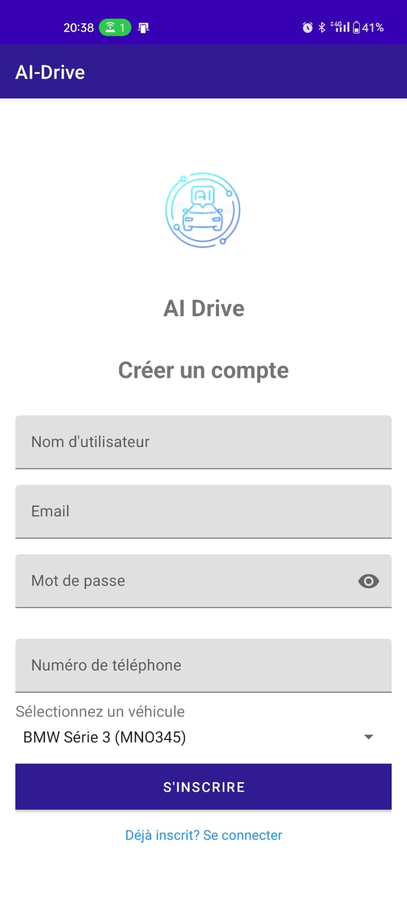
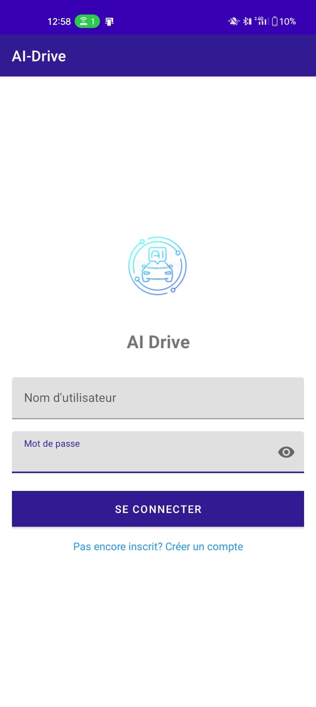
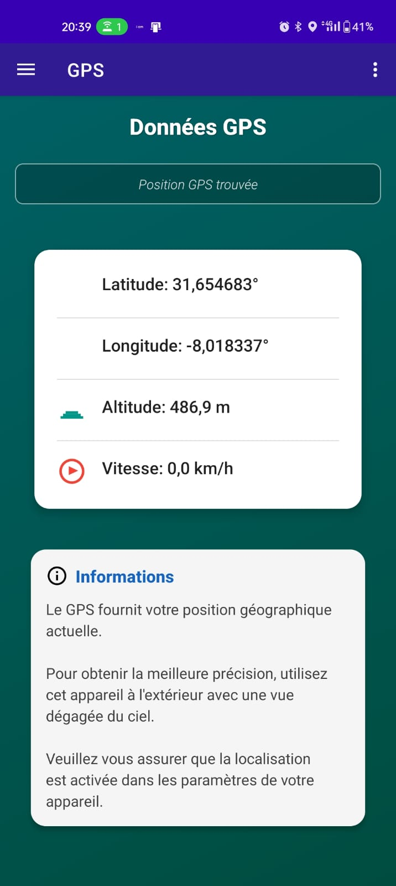
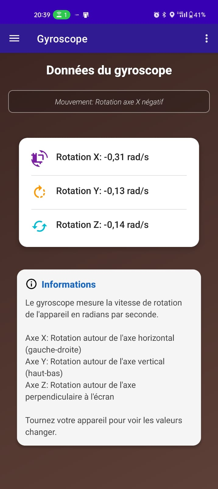
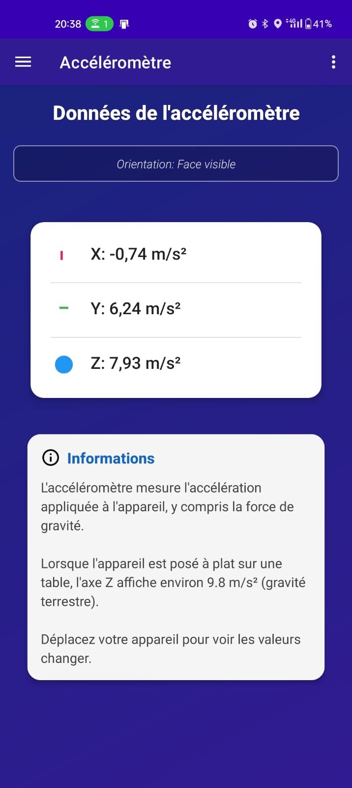
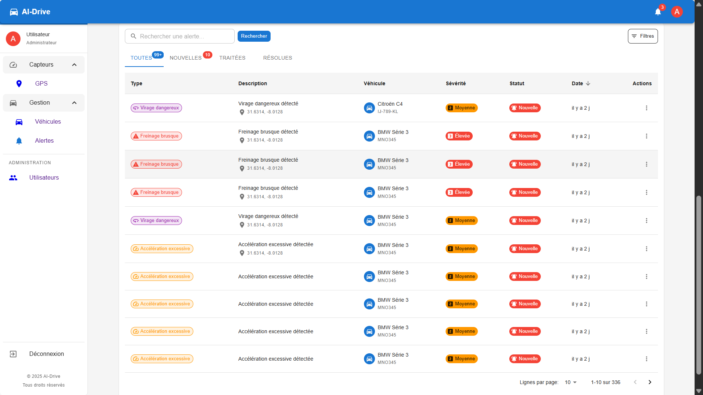
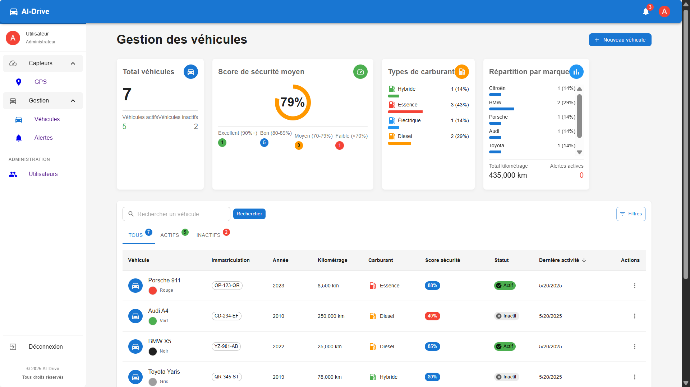
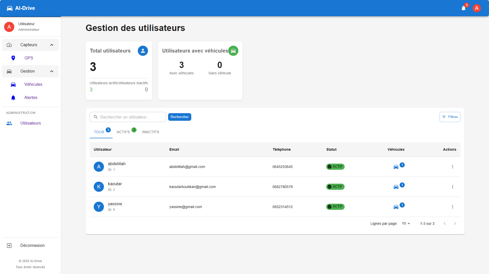
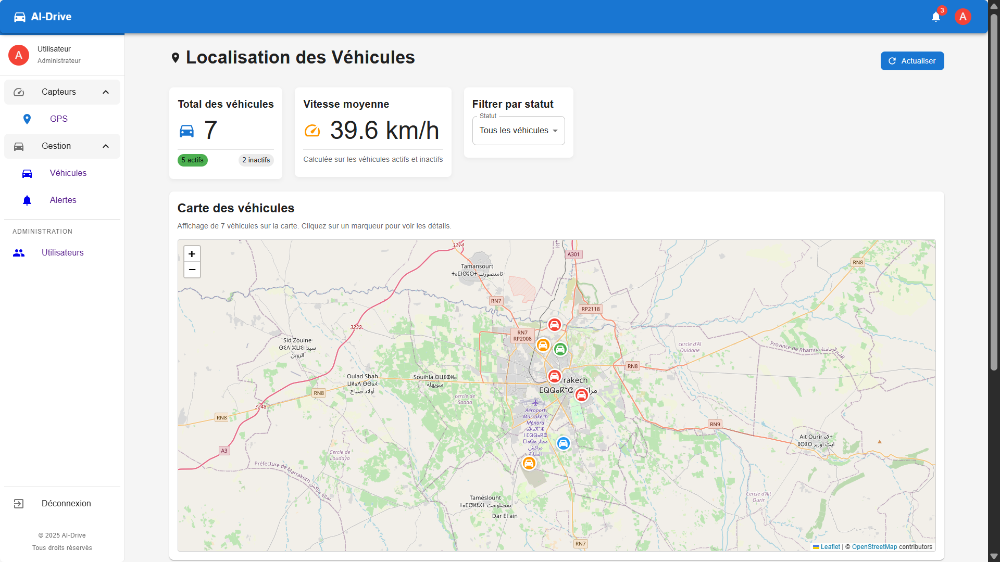
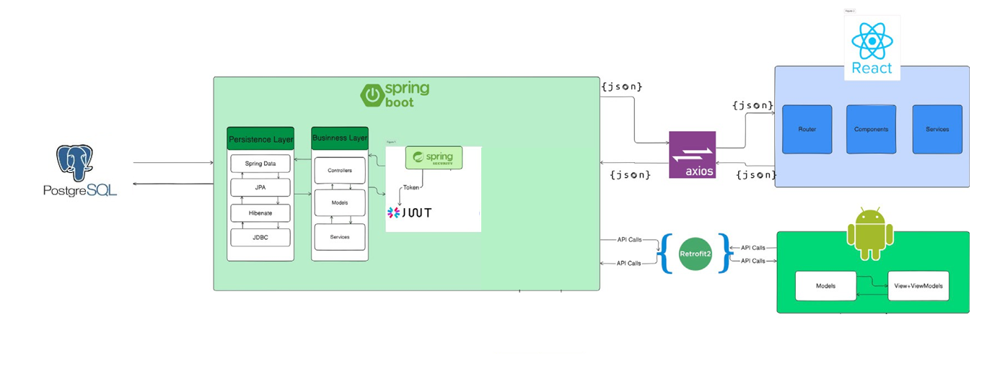

# Application Android de Surveillance de Conduite

[](https://android.com)
[](https://android-arsenal.com/api?level=21)
[](LICENSE)
[](https://github.com/abdelboulgha/AI-DRIVE/releases)

> AI-Drive est une application Android intelligente qui utilise les capteurs intégrés du smartphone pour surveiller et analyser le comportement de conduite en temps réel.

## Table des Matières

- [Description](#description)
- [Fonctionnalités](#fonctionnalités)
- [Technologies](#technologies)
- [Captures d'écran](#captures-décran)
- [Installation](#installation)
- [Utilisation](#utilisation)
- [Architecture](#️architecture)
- [Sécurité](#sécurité)
- [Roadmap](#️roadmap)
- [Contribution](#contribution)
- [Équipe](#équipe)

## Description

AI-Drive est une application Android intelligente qui utilise les capteurs intégrés du smartphone pour surveiller et analyser le comportement de conduite en temps réel. L'application détecte automatiquement les comportements de conduite dangereux et envoie des alertes pour améliorer la sécurité routière.

### Pourquoi AI-Drive ?

- **Sécurité renforcée** : Détection proactive des comportements à risque
- **Analyse en temps réel** : Monitoring continu via capteurs smartphone
- **Alertes intelligentes** : Notifications personnalisées et contextuelles
- **Simplicité d'usage** : Interface intuitive et installation facile


## Fonctionnalités

###  Authentification & Gestion Utilisateur
- Inscription et connexion sécurisées
- Authentification JWT avec gestion de session
- Association multi-utilisateurs/véhicules

###  Collecte de Données Avancée
| Capteur | Fonction | Utilisation |
|---------|----------|-------------|
| **Accéléromètre** | Mouvements et orientations | Détection freinages/accélérations |
| **Gyroscope** | Rotations et virages | Analyse stabilité et virages |
| **GPS** | Localisation précise | Vitesse, altitude, géofencing |

### Détection d'Alertes
- **Freinage brusque** : Seuils adaptatifs selon conditions
- **Accélération excessive** : Monitoring intelligent des G-forces
- **Virages dangereux** : Analyse vectorielle des trajectoires
- **Vitesse excessive** : Respect limites et zones de sécurité


### Gestion Intelligente des Véhicules
- Basculement automatique entre véhicules
- Profils personnalisés par véhicule
- Historique et statistiques de conduite
- Calibrage automatique des seuils

## Technologies

### Frontend Mobile
```
 Android SDK (Java)
 Retrofit 2 - API REST
 Gson - JSON parsing
 Navigation Component
 SharedPreferences - Stockage local
 MPAndroidChart - Graphiques
```

### Capteurs
```
 Android Sensor Framework
 Algorithmes de détection personnalisés
 Google Location Services
 Traitement temps réel
```

## Captures d'écran

**partie mobile**
<div align="center">
<table>
  <tr>
    <td align="center">
      
      <br><strong>Page d'Accueil</strong>
    </td>
    <td align="center">
      
      <br><strong>Inscription</strong>
    </td>
    <td align="center">
      
      <br><strong>Se connecter</strong>
    </td>
  </tr>
  <tr>
    <td align="center">
      
      <br><strong>GPS</strong>
    </td>
    <td align="center">
      
      <br><strong>Gyroscope</strong>
    </td>
    <td align="center">
      <!-- Espace pour future capture -->
      
      <br><strong>Accéléromètre</strong>
    </td>
  </tr>
</table>
</div>


**partie web**
<div align="center">
<table>
  <tr>
    <td align="center">
      
      <br><strong>Gestion des alertes</strong>
    </td>
  </tr>
  <tr>
    <td align="center">
      
      <br><strong>Gestion des véhicules</strong>
    </td>
  </tr>
  <tr>
    <td align="center">
      
      <br><strong>Gestion des utilisateurs</strong>
    </td>
  </tr>
  <tr>
    <td align="center">
      
      <br><strong>Localisation des véhicules</strong>
    </td>
  </tr>
</table>
</div>


## Installation

### Prérequis

| Composant | Version requise |
|-----------|----------------|
| Android Studio | 4.0+ |
| SDK Android | API 21+ (Android 5.0) |
| Appareil | Capteurs obligatoires |
| Connexion | Internet requis |

### Configuration Rapide

1. **Cloner le repository**
   ```bash
   git clone https://github.com/abdelboulgha/AI-DRIVE.git
   cd AI-DRIVE
   ```

2. **Configuration API**
   
   Modifiez `app/src/main/java/com/aidrive/api/ApiClient.java` :
   ```java
   public class ApiClient {
       // Remplacez par l'IP de votre serveur backend
       private static final String BASE_URL = "http://VOTRE_IP:8080/api/v1/";
       
       // Configuration SSL en production
       private static final boolean USE_HTTPS = false; // true en production
   }
   ```

3. **Vérification des permissions**
   
   Dans `app/src/main/AndroidManifest.xml` :
   ```xml
   <!--  Localisation précise -->
   <uses-permission android:name="android.permission.ACCESS_FINE_LOCATION" />
   <uses-permission android:name="android.permission.ACCESS_COARSE_LOCATION" />
   
   <!--  Réseau -->
   <uses-permission android:name="android.permission.INTERNET" />
   <uses-permission android:name="android.permission.ACCESS_NETWORK_STATE" />
   
   <!--  Performance -->
   <uses-permission android:name="android.permission.WAKE_LOCK" />
   <uses-permission android:name="android.permission.FOREGROUND_SERVICE" />
   ```


## Utilisation

###  Premier lancement

1. **Création de compte**
   - Email valide + mot de passe sécurisé
   - Validation par email (optionnel)

2. **Configuration véhicule**
   - Sélection dans catalogue ou création personnalisée
   - Calibrage initial des capteurs

3. **Permissions système**
   - Localisation : "Toujours autoriser"
   - Capteurs : Accès automatique
   - Notifications : Recommandé

### Utilisation Quotidienne
1. **Connexion** : Se connecter avec vos identifiants
2. **Sélection véhicule** : L'application sélectionne automatiquement le dernier véhicule utilisé
3. **Conduite** : L'application surveille automatiquement en arrière-plan
4. **Alertes** : Réception de notifications en cas de conduite dangereuse

###  Interface utilisateur

| Onglet | Fonction | Données affichées |
|--------|----------|-------------------|
|  **Dashboard** | Vue d'ensemble | Score conduite, alertes récentes |
|  **Accéléromètre** | Monitoring G-forces | Graphiques temps réel X,Y,Z |
|  **GPS** | Localisation | Vitesse, altitude, trajet |
|  **Gyroscope** | Stabilité | Rotations, inclinaisons |
|  **Historique** | Statistiques | Trajets, tendances, progression |

##  Architecture




## Sécurité

###  Authentification
- **JWT Tokens** : Expiration automatique (24h)
- **Refresh Tokens** : Renouvellement transparent
- **Chiffrement** : AES-256 pour données sensibles
- **HTTPS** : Communication sécurisée en production


##  Roadmap

###  Version 1.1 (Q2 2025)
- [ ]  Mode nuit automatique
- [ ]  Intégration assistant vocal
- [ ]  Widget tableau de bord
- [ ]  Support multi-langues

### Version 2.0 (Q4 2025)
- [ ]  IA prédictive avancée
- [ ]  Partage social des scores
- [ ]  Système de gamification
- [ ]  Synchronisation cloud

###  Vision long terme
- [ ]  Intégration véhicules connectés
- [ ]  Données de trafic temps réel
- [ ]  Version iOS
- [ ]  API publique pour développeurs

##  Contribution

Nous accueillons toutes les contributions ! 

###  Comment contribuer

1. **Fork** le repository
2. **Créez** une branche feature (`git checkout -b feature/AmazingFeature`)
3. **Committez** vos changements (`git commit -m 'Add: Amazing Feature'`)
4. **Push** vers la branche (`git push origin feature/AmazingFeature`)
5. **Ouvrez** une Pull Request

###  Guidelines
-  Code commenté en français
-  Tests pour nouvelles fonctionnalités
-  Documentation mise à jour
-  Respect des conventions Android


## Équipe

### Développeurs principaux

<table>
  <tr>
    <td align="center">
      <br>
      <sub><b>Abdelillah Boulgha</b></sub><br>
      <sub> Lead Developer</sub><br>
      <a href="mailto:boulghaabdelillah@gmail.com">📧 Contact</a>
    </td>
    <td align="center">
      <br>
      <sub><b>Kaoutar Boubkari</b></sub><br>
      <sub> Lead Developer</sub><br>
      <a href="mailto:boubkarikaoutar1@gmail.com">📧 Contact</a>
    </td>
  </tr>
</table>

---

###  Support & Contact

- **Bugs** : [Issues GitHub](https://github.com/abdelboulgha/AI-DRIVE/issues)
- **Suggestions** : [Discussions](https://github.com/abdelboulgha/AI-DRIVE/discussions)
- **Email** : boulghaabdelillah@gmail.com
- **Email** : boubkarikaoutar1@gmail.com
- **Site web** : [AI-Drive.com](https://ai-drive.com) *(à venir)*

---

<div align="center">

**🚗 Conduisez plus intelligemment avec AI-Drive 🚗**

[](https://play.google.com/store/apps/details?id=com.aidrive)
[](https://github.com/abdelboulgha/AI-DRIVE)


</div>
